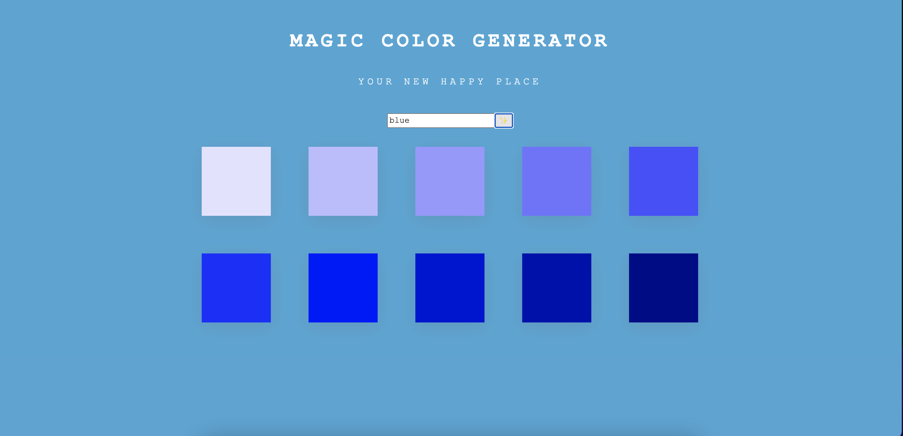

# Project 1 - Color Generator

# Description

- This weboage displays a gradient of colors based on the original color user inputs. Uses third party API's to display colors matching user input. Combines knowledge acquired over the past 6 weeeks of coding program (including: HTML, CSS, JAVASCRIPT, API's).

# Site Preview 

# Github Links 

- Repository: https://github.com/mxhuisken/colorGenerator
- Deployed: https://mxhuisken.github.io/colorGenerator/

# Requirements

- Use a CSS framework(Bootstrap or others).
- Be deployed to GitHub Pages.
- Be interactive (i.e., accept and respond to user input).
- Use at least one [server-side APIs]
- Does not use alerts, confirms, or prompts (use modals).
- Use client-side storage to store persistent data IF APPLICABLE.
- Responsive site & polished UI
